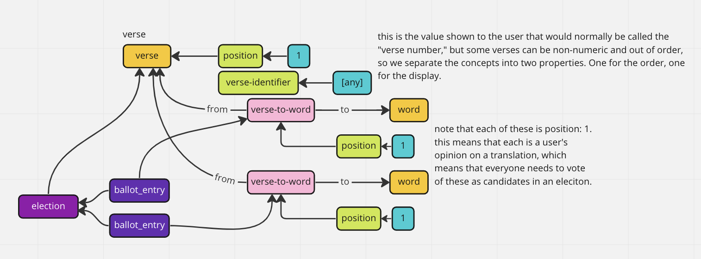
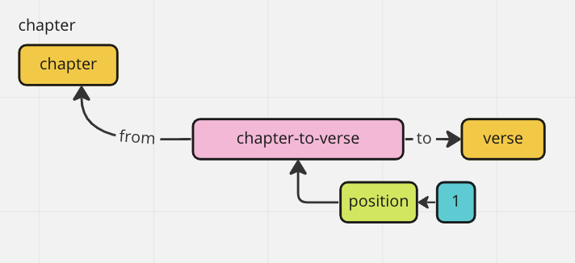
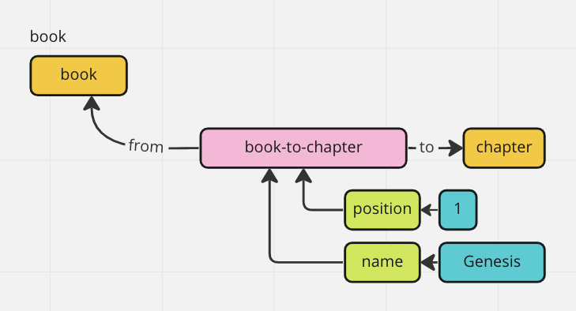
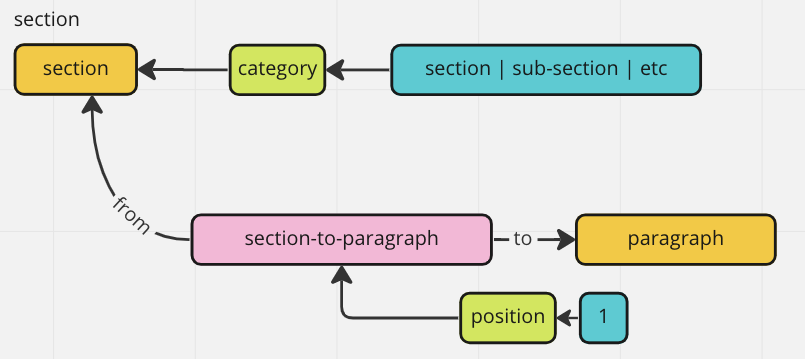

# Graph Schema

## Introduction

The graph schema is designed specifically to fit the needs of a crowd-sourcing application. It can be used to persist any kind of data structure, while allow the structure to be mutated in any way by any one. Any form of the structure can be recovered for any use case. 

For example, you could have a document that you want everyone to be able to edit in any way they see fit. You also want to be able to view the document using only the edits of certain users during a certain timeframe. You'd also like to let users vote on different edits to the document, while showing the document using the most voted on edits, while also giving the option to show the edits from the votes of a specific group of users.

## Tables

Database [schema](https://github.com/etenlab/database-api/blob/main/src/core/sql/schema/v1.schema.sql)

- `node_types`
- `node_property_keys`
- `node_property_values`
- `relationship_types`
- `relationships`
- `relationship_property_keys`
- `relationship_property_values`

## Graph API Layer 1

Layer 1 is the only layer that interacts with the type models.

### Node Type
- createNodeType(type_name: string): string
- listNodeTypes(): String[]
- listAllNodesByType(type_name: string): Node[]

### Nodes
- listAllNodesByType(type_name: string): Node[]
- createNode(type_name: string): uuid
- createNodePropertyKey(node_id: uuid, key_name: string): uuid
- createNodePropertyValue(key_id: uuid, key_value: any): uuid
- readNode(node_id: uuid) Node

### Relationship Type
- createRelationshipType(type_name: string): uuid
- listRelationshipsTypes(): String[]
- listAllRelationshipsByType(type_name: string): Relationships[]

### Relationships
- createRelationship(node_1: uuid, node_2: uuid, type_name: string): uuid
- createRelationshipPropertyKey(rel_id: uuid, key_name: string): uuid
- createRelationshipPropertyValue(key_id: uuid, property_value: any): uuid
- readRelationship(rel_id: uuid): Relationship
- listRelatedNodes(node_id: uuid): [{relationship, node}]

### Elections
- createElection():uuid
- addBallotEntry(election_id: uuid, node_id: uuid): uuid
- addVote(ballot_entry_id: uuid, vote: boolean): uuid
- addVote(ballot_entry_id: uuid): boolean
- readElection(election_id: uuid): Election

### Discussion
- createDiscussion(): uuid
- createPost(discussion_id: uuid, content: string): uuid
- updatePost(post_id: uuid): boolean
- deletePost(post_id: uuid): boolean
- readDiscussion(discussion_id: uuid): Discussion

## Graph API Layer 2

Layer 2 only calls layer 1 functions.

### Legend

### Word

### Word Sequence

### Word to Article Link

### Verse

### Chapter

### Book

### Bible

### Sentence

### Article

### Paragraph

### Section

### Section of Sections

### Strong's Entry

### Strong's Word Link

### External Content

### Voting

