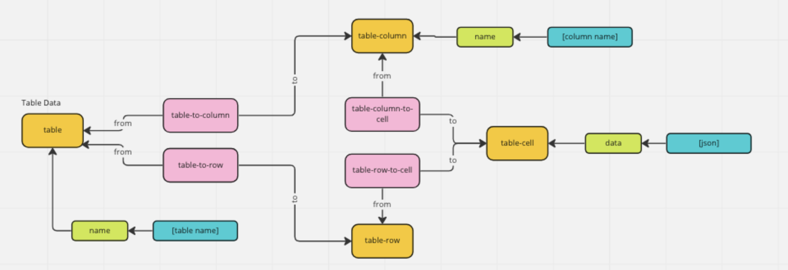
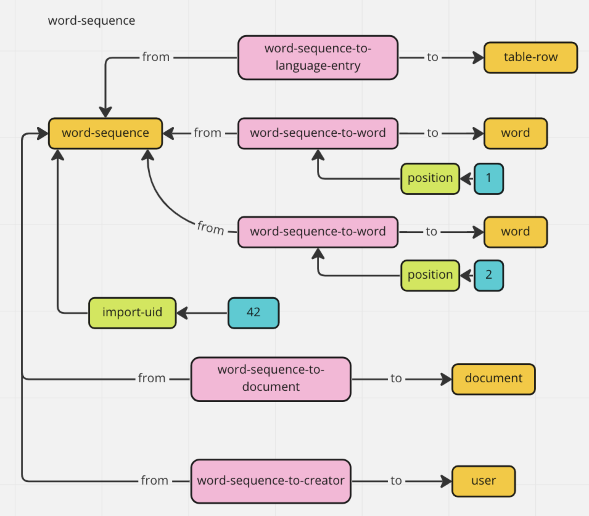

# Graph Schema

## Introduction

The graph schema is designed specifically to fit the needs of a crowd-sourcing application. It can be used to persist any kind of data structure, while allow the structure to be mutated in any way by any one. Any form of the structure can be recovered for any use case.

For example, you could have a document that you want everyone to be able to edit in any way they see fit. You also want to be able to view the document using only the edits of certain users during a certain timeframe. You'd also like to let users vote on different edits to the document, while showing the document using the most voted on edits, while also giving the option to show the edits from the votes of a specific group of users.

## Tables

Database [schema](https://github.com/etenlab/database-api/blob/main/src/core/sql/schema/v1.schema.sql)

- `node_types`
- `nodes`
- `node_property_keys`
- `node_property_values`
- `relationship_types`
- `relationships`
- `relationship_property_keys`
- `relationship_property_values`

### Legend for Illustrations

- Nodes are represented by orange boxes and are the root unit of how we store information in the graph. 
- Every node has a type name stored as a string.
- Relationships (rel) connect two nodes.
- Every rel has a type name stored as a string.
- Both nodes and relationships can have properties.
- Properties are split into keys and values.
- Property keys point to a node or rel. 
- Property values point to a property key.
- The decoupling of property keys and values allows us to expose options to users so that they can vote on whether a key is appropriate or not on a node/rel, as well as voting on what the value should be for each property key. This is one important way in which we enable crowd-sourcing.

## API

### Node Type

- createNodeType(type_name: string): string
- listNodeTypes(): String[]
- listAllNodesByType(type_name: string): Node[]

### Nodes

- listAllNodesByType(type_name: string): Node[]
- createNode(type_name: string): uuid
- createNodePropertyKey(node_id: uuid, key_name: string): uuid
- createNodePropertyValue(key_id: uuid, key_value: any): uuid
- readNode(node_id: uuid) Node

### Relationship Type

- createRelationshipType(type_name: string): uuid
- listRelationshipsTypes(): String[]
- listAllRelationshipsByType(type_name: string): Relationships[]

### Relationships

- createRelationship(node_1: uuid, node_2: uuid, type_name: string): uuid
- createRelationshipPropertyKey(rel_id: uuid, key_name: string): uuid
- createRelationshipPropertyValue(key_id: uuid, property_value: any): uuid
- readRelationship(rel_id: uuid): Relationship
- listRelatedNodes(node_id: uuid): Array\<\{relationship: [Relationship Object], node: [Node Object]\}\>

### Elections

- createElection():uuid
- addBallotEntry(election_id: uuid, node_id: uuid): uuid
- addVote(ballot_entry_id: uuid, vote: boolean): uuid
- addVote(ballot_entry_id: uuid): boolean
- readElection(election_id: uuid): Election

### Discussion

- createDiscussion(): uuid
- createPost(discussion_id: uuid, content: string): uuid
- updatePost(post_id: uuid): boolean
- deletePost(post_id: uuid): boolean
- readDiscussion(discussion_id: uuid): Discussion

### Node/Relationship CREATE Convenience Wrappers

These functions will always create a new node or relationship. The root keys of the object will be used as the unique keys of the new node/relationship. The values of those keys will be the child value/object of the root keys passed in.

- createNodeFromObject(type_name: string, obj: {}): Node
- createRelationshipFromObject(type_name: string, obj: {}, from_node: uuid, to_node: uuid): Relationship
- createRelatedToNodeFromObject(node_uuid: uuid, rel_type_name: string, type_name: string, obj: {}): \{relationship: [Relationship Object], node: [Node Object]\}
- createRelatedFromNodeFromObject(type_name: string, obj: {}, rel_type_name: string, node_uuid: uuid): \{relationship: [Relationship Object], node: [Node Object]\}

### Upsert Node/Relationship Convenience Wrappers

These operations use a previously created node/relationship and are idempotent with key creation. They will first search for a key before inserting.

- upsertNodeObject(node_uuid: uuid, obj: {}): Node
- upsertRelationshipObject(rel_uuid: uuid, obj: {}): Relationship

### Table Data

- createTable(name: string): Table
- addTableData(table_name: string, column_name: string, row_id: string, cell_data: any): Cell
- getTable(name: string): Table

### Key Terms

### Document

- createDocument(name: string): uuid
  - `name`: the name of the document you want to create
  - returns the uuid of the `document` node
- getDocument(name: string): uuid
  - `name`: the name of the doucment you want to find
  - returns the uuid of the `document` node if there is one, `null` if not found.

### Word

- createWord(word: string): uuid
  - `word`: the word. There shouldn't be any spaces. In the current system we define words by splitting on white space.
  - Returns the uuid of the word created. If a word already exists, it will return the uuid of the previously created word.
- getWord(word: string): uuid
  - `word`: the word you want to find.
  - Returns the uuid of the `word` node. `null` if no word is found.

### Word Sequence

- createWordSequence(text: string, document: uuid, creator: uuid, import-uid: string): uuid
  - `text`: the word sequence to store in the graph. The function will split it using whitespace and not punctuation. Tokens created from the string will be used to create the word nodes
  - `document`: the documnet node uuid that the new `word-sequence` node will be associated to.
  - `creator`: the `user` node uuid that the new `word-sequence` node will be associated to. This is not the owner of the text (if any), this is the user account who imported/created it in the system.
  - `import-uid`: this is a free field for the importer/creator to use to distinguish different imports or versions. This will can be used later in read queries to show different import runs.
  - Returns the node uuid from the `word-sequence` node created.
  - This function will always create a new `word-sequence`.

### Word Sequence Connection

- appendWordSequence(from: uuid, to: uuid): uuid
  - `from`: uuid of the `word-sequence` node that should be first in the sequence.
  - `to`: uuid of the `word-sequence` node that should come second in the sequence.
  - Returns the uuid of the relationship node that is created.
  - This is how we will store documents in our system. Documents are series of `word-sequence` nodes.
- getWordSequence(text: string): uuid[]
  - `text` string of words to find in the database
  - Returns an array of `word-sequence` node uuids if there are any that match the `text` given. `null` if no uuids where found.

### Voting

