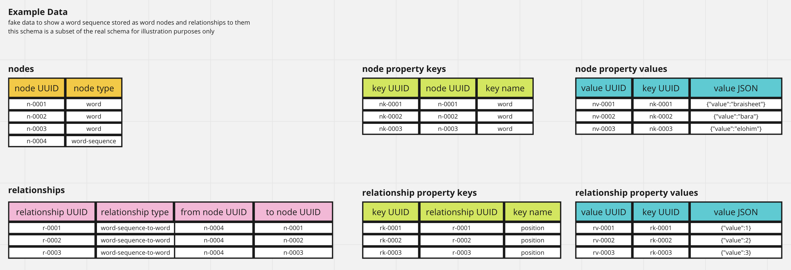
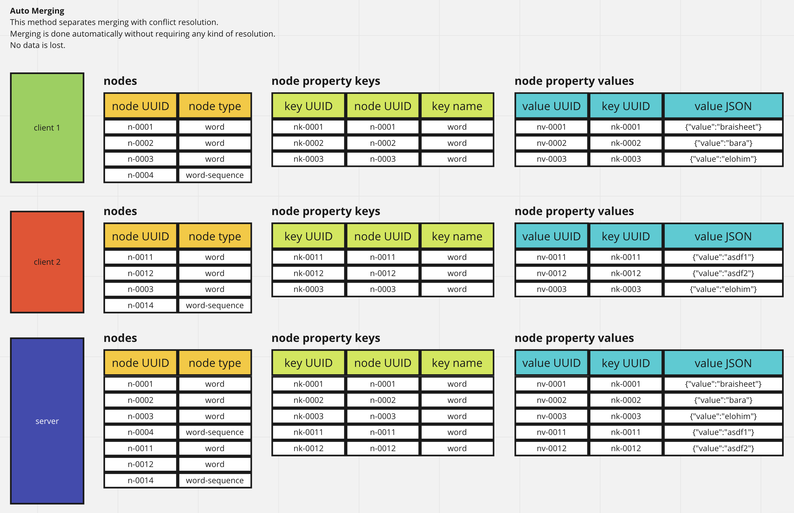

# Abstract Graph Schema

The BiblioNexus Foundation Abstract Graph Schema (AGS) is meant to provided applications a data interchange format that provides for the following features:

### Features

1. **Auto-merging**: merging any and all datasets is conflict-free.
1. **Graph friendly**: graph structures can potentially include a large amount of many-to-many relationships. Storing large graphs in trees or documents can lead to an explosion of pointers/references. A native graph format is best for large graphs while it also is able to accomodate other structures like trees, lists, sets, tables, and documents.
1. **Sub-schemas**: we don't want to dictate how other apps schema their data. By requiring an abstract graph structure, apps are able to provide their own sub-schemas on top of the abstract graph schema to accommodate the preferences for each application. No communication is needed between teams to agree on sub-schemas, yet everyone still enjoys the auto-merging features of the abstract graph and is able to use each other's sub-schemas by choice.
1. **Immutibility**: data is never deleted, only appended. This enables version/time aware queries to be used.

### Advantages

1. The data that an organization makes public can be combined with all other public data without conflict.
1. Organizations can build layers of data on other data they don't control without affecting each data layer's owner.
1. Organizations can use each other's data without explicitly knowing all of the schema. 
1. When an org wants to link to another org's dataset, they only need to know the parts of the schema they are interested about. They don't need to learn it all, and schema/data can change over time without affecting either org.
1. Datasets can change over time or be updated by anyone. If the source of truth database doesn't want to recieve changes, the community can still have access to changes made by other providers.
1. Everyone has the ability to selectively agree with changes made by others. A source of truth database can choose which changes to apply, if any. 
1. Auto-merging will make building peer-to-peer applications easier.

## Graph Concepts

The graph we implement is made of entities called nodes and relationships. Each entity can have key-value properties. 

## The Six Tables

The abstract graph schema is implemented using 6 data types that map to six SQL tables. There is a table each for nodes and relationships. For properties, we 'explode' them, creating a table for keys and one for values for both nodes and relationships. So four tables in all to store properties.

The Six Tables are:
1. `nodes`
1. `relationships`
1. `node_property_keys`
1. `relationship_property_keys`
1. `node_property_values`
1. `relationship_property_values`

Each table uses a `UUID` as its unique primary key and for any necessary foreign key references.

### Example Graph Data

Here is an example of a `word-sequence` of 3 `word`s being stored in the abstract graph tables. This is just one use of the abstract tables, applications don't need to agree to the concept of a `word` or `word-sequence` node.

- The actual `node`s are created in the `nodes` table with `node_type` = `word`.
- Each node has an entry in the `node_property_keys` table to show that each `node` has a property named `word` (don't confuse a property key with a `node_type` name). 
- Each property key has a value in the `node_property_values` table that holds it's actual value, which in this case is the actual word itself.
- A `word-sequence` node is created that does not have any properties.
- `relationship`s are used between the `word-sequence` node and the `word` nodes. The properties of those relationships hold the position data of each `word` in the `word-sequence`.
- Not every app needs to have the concept of a `word` node, but if used, it let's apps normalize their data on each word. This sub-schema keeps relationships between words and concepts intact. As new documents are added, each will enjoy the relationships made between the words in the document and any reference material that has been linked to those words.
- The `UUID`s appear as small, auto-incrementing alpha-numerics. This is just for illustration purposes to make it easier to keep track of relationships. The values in the real tables will be actual `UUID`s.

### Auto-Merging Example

- Since all abstract data types/tables/graphs use `UUID`s as their unique key, merging is trivial.
- If two merged sub-graphs reference a common sub-graph, then merging automatically enables intelligent queries to hop between sub-graphs.
- If there is no common sub-graph between two merging sub-graphs, the application is free to decide if/when to be aware of the new sub-graph, but merging can still happen at any time.
- In the above illustration, client 2 shares a common word `node` with client 1 (`n-0003`) and therefore the `word-sequence` in client 2 can point to the same `node` as client 1.
